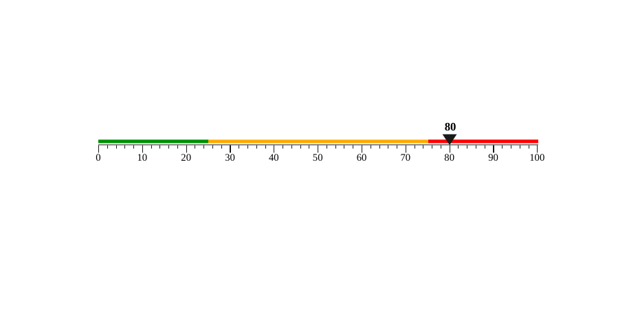

<!-- @format -->

**Installation**

> npm i linear-guage-chart

**Basic usage**

```
import Gauge from "./Gauge";

const App = () => {
  return (
    <>
      <Gauge percent="80" />
    </>
  );
};
```

**result**


